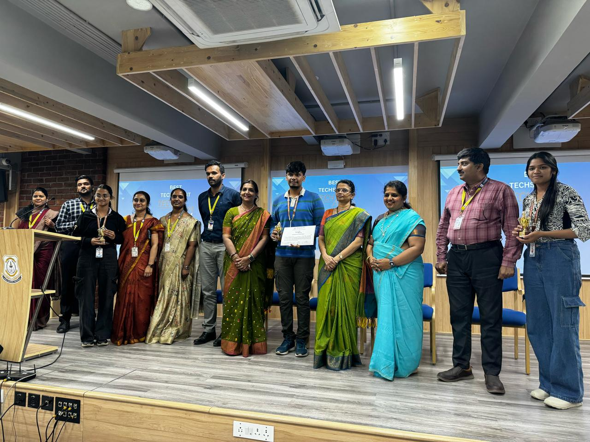
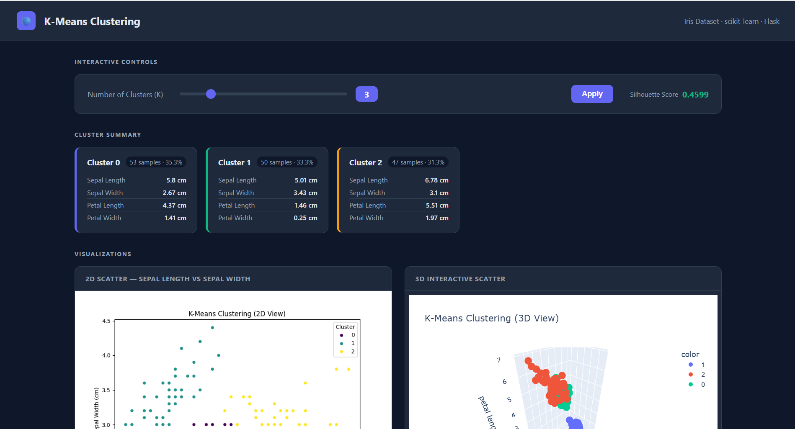
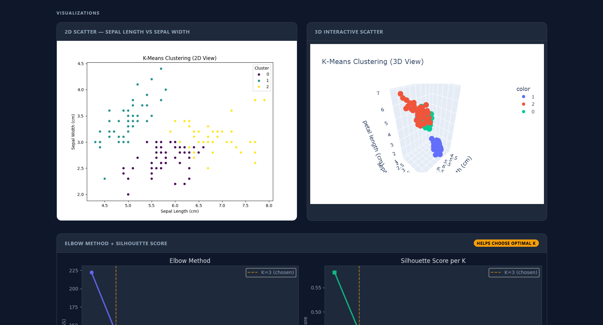
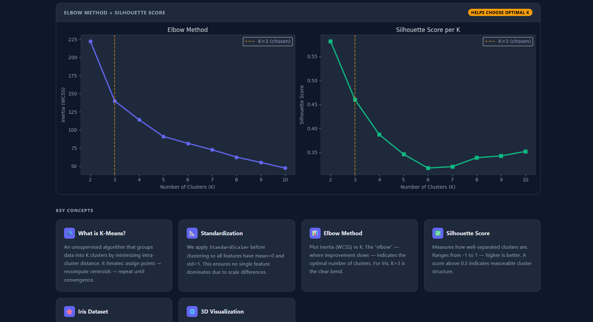

# 📊 K-Means Clustering Dashboard — Iris Dataset

<p align="center">
  
  
  
  
</p>

<p align="center">
  <b>🥈 2nd Place Winner — TechSprint 2K25 | Surana College, Dept. of Computer Science</b>
</p>

<p align="center">
  <a href="https://kmeans-self-1.onrender.com/">
    
  </a>
</p>

---

## 🏆 Achievement

Secured **🥈 2nd Place** at **TechSprint 2K25** — a 2-day Project Based Workshop on Machine Learning & AI organized by the Department of Computer Science (UG), Surana College – Autonomous, South End Campus on **27th & 28th February 2025**.

<p align="center">
  
</p>

<p align="center">
  
</p>

---

## 🌐 Live Demo

👉 https://kmeans-dashboard-self.onrender.com

> Note: Hosted on Render free tier — may take ~30 seconds to wake up on first visit.

---

## 📸 Screenshots

<p align="center">
  
</p>

<p align="center">
  
</p>

<p align="center">
  
</p>

---

## 💡 About

An interactive web dashboard that applies **K-Means clustering** on the classic **Iris dataset**. Built independently after completing a workshop training session on unsupervised machine learning.

Goes beyond basic clustering — change K dynamically, see why K=3 is optimal via the elbow method, and view per-cluster statistics in real time.

---

## ✨ Features

- **Interactive K Slider** — change clusters (2–8), results update live without page reload
- **Elbow Method Chart** — visualizes inertia vs K to justify the optimal cluster count
- **Silhouette Score** — updates in real time as you change K
- **Cluster Stat Cards** — per-cluster mean of all 4 Iris features
- **2D Scatter Plot** — seaborn visualization of clusters
- **3D Interactive Plot** — Plotly 3D scatter, rotatable in browser
- **Concept Cards** — explains K-Means, standardization, elbow method

---

## 🛠 Tech Stack

| Tool | Purpose |
|---|---|
| Python | Core language |
| Flask | Web framework |
| scikit-learn | K-Means, silhouette score |
| Pandas / NumPy | Data handling |
| Matplotlib / Seaborn | 2D plots |
| Plotly | 3D interactive chart |
| HTML / CSS / JS | Dark dashboard UI |

---

## 🚀 Run Locally

```bash
git clone https://github.com/shreyav01/kmeans-dashboard_self.git
cd kmeans-dashboard_self
pip install -r requirements.txt
python app.py
```

Open `http://127.0.0.1:5000` in your browser.

---

## 📁 Project Structure

```
kmeans-dashboard_self/
│
├── app.py                  # Flask routes
├── kmeans_irss.py          # Clustering logic, elbow, stats
├── requirements.txt
├── templates/
│   └── index.html          # Dark dashboard UI
├── static/
│   ├── plot_2d.png
│   ├── plot_3d.html
│   └── plot_elbow.png
└── assets/
    ├── dashboard.png
    ├── plots.png
    ├── elbow.png
    ├── trophy_cert.jpg
    └── award_photo.jpg
```

---

## 👩‍💻 Author

**Shreya V**
2nd Year CSE (AI & ML), Global Academy of Technology
🥈 TechSprint 2K25 — Surana College

---

*Built after completing the ML workshop — [view training session repo](https://github.com/shreyav01/ml-workshop-kmeans-practice)*
